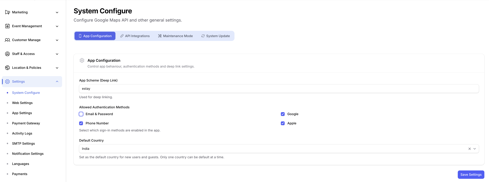
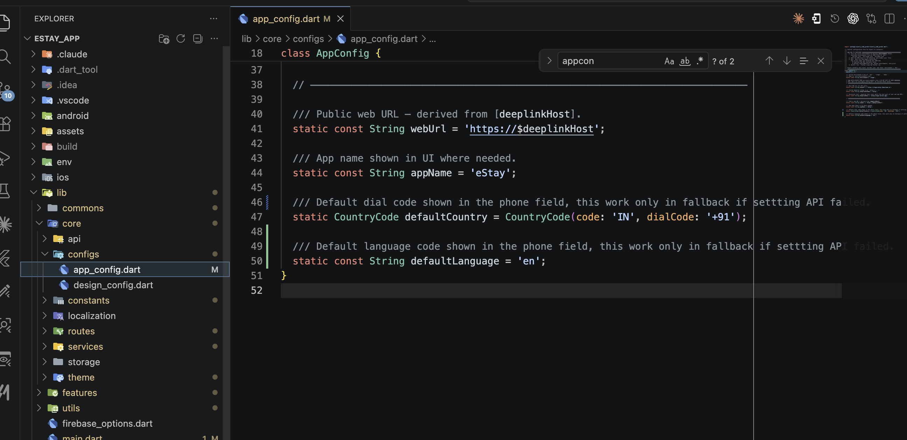

# Configure Auth Methods & Default Country

Both the **allowed login methods** and the **default country** shown in the country picker (used during phone-number login) are controlled from a single admin-panel screen.

## How to Access

1. Log in to the your **Admin Panel**.
2. Navigate to **Settings → System Configure**.

## Allowed Authentication Methods

In the **Allowed Authentication Methods** section:

- **Select** the login methods you want to enable (Email, Google, Apple, Phone.).
- **Deselect** any method you want to hide from the app.
- Click **Save** — the app fetches the updated list on next launch and shows only the enabled login options.

:::tip
Each enabled method must also be fully configured in Firebase (e.g., Google Sign-In credentials, Apple Sign-In key, Phone OTP billing). Otherwise the option will appear in the app but fail at runtime.
:::

## Default Country

In the **Default Country** field on the same page:

- Select the country you want to set as the default in the app's country picker.
- This affects the phone-number country code prefix shown to  users.
- Click **Save** to apply.

Users can still change the country manually inside the app — this setting only controls the initial default.

### Fallback Default in App Code

As a safety net, a default country code is hardcoded in the app's config file. This value is **only used when the settings API call fails** (e.g., no internet on first launch).

1. Open `lib/core/configs/app_config.dart`.
2. Update the `defaultCountry` constant to the country code you want as fallback.

:::info
The admin-panel default (above) is the **primary** source of truth. The `app_config.dart` value is only a fallback for offline / API-failure scenarios.
:::
