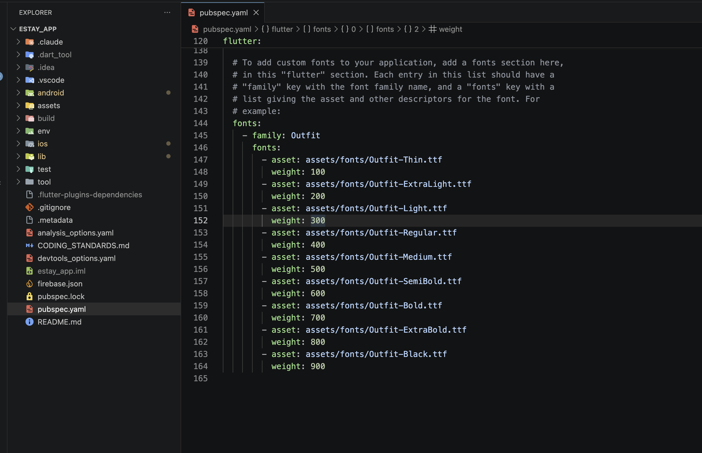

# Change App Font

Swap the default font for one of your choice across the entire app.

## Step 1 — Drop the Font File

Place your font files (`.ttf` or `.otf`) inside the `assets/fonts/` directory of the project.

## Step 2 — Register the Font in `pubspec.yaml`

Open `pubspec.yaml` and update the `fonts:` block under the `flutter:` section to point to your file:

```yaml
flutter:
  fonts:
    - family: CustomFont
      fonts:
        - asset: assets/fonts/MyCustomFont.ttf
```

- `family` — name you'll reference from Dart code (case-sensitive).
- `asset` — path to the file you added in Step 1.

For multi-weight fonts, list each file with its `weight` (e.g. `400` for regular, `700` for bold).

## Step 3 — Apply the Font in the App Theme

Open the theme file at `lib/core/theme/app_text_styles.dart` and change the new font in  `primaryFont`:

```dart
class AppTextStyles {

  static const String primaryFont = 'CustomFont';

}
```

The string must match the `family:` value from `pubspec.yaml` exactly.



## Step 4 — Rebuild

```bash
flutter pub get
flutter clean && flutter run
```

The new font should now be applied across all screens.

:::tip
Register every weight your UI uses (regular, medium, bold, etc.) in the `pubspec.yaml` fonts block. Otherwise Flutter synthesizes missing weights, which can look thin or jagged on some devices.
:::
