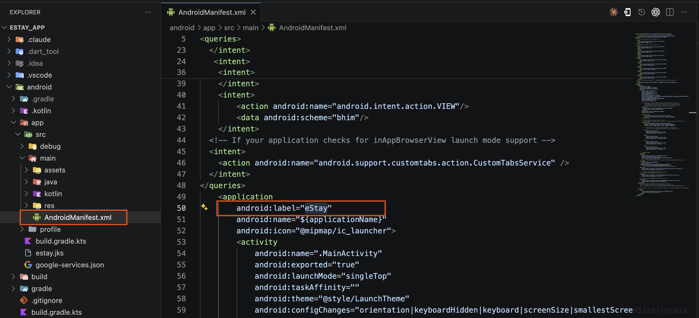
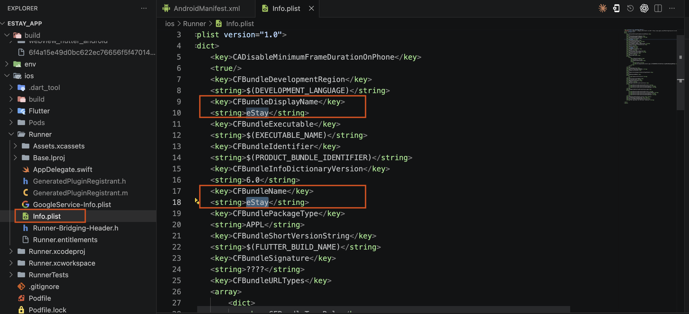
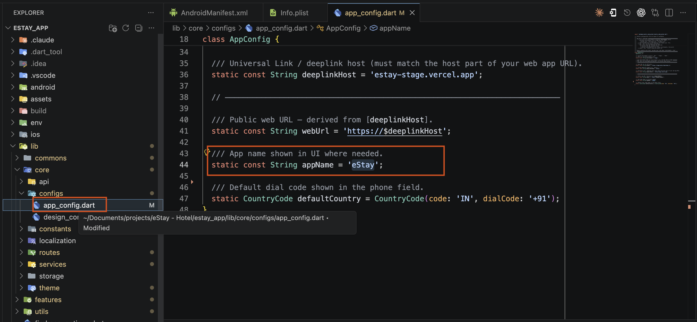

# Change App Name

Update the displayed app name on Android, iOS, and inside the app code.

## Android Configuration

1. Navigate to `android/app/src/main/AndroidManifest.xml`.
2. Change the app name by modifying the `android:label` value inside the `<application>` tag.



## iOS Configuration

1. Navigate to `ios/Runner/Info.plist`.
2. Change the app name by modifying the `CFBundleDisplayName` and `CFBundleName` values.



## Change App Name in Code

1. Open `lib/core/configs/appConfig.dart`.
2. Change the value of the `appName` variable to your desired app name.




Save the changes.

Rebuild the app by running the following commands:
```
flutter clean
flutter pub get
flutter run
```