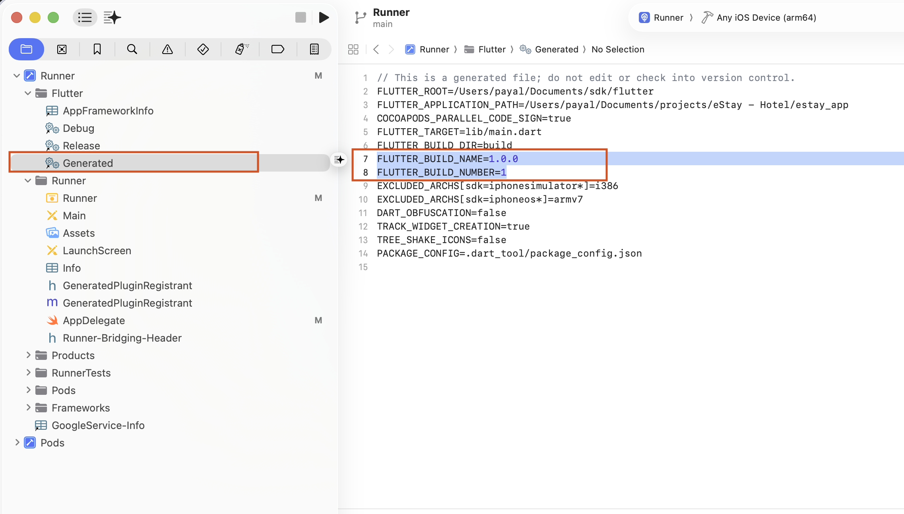
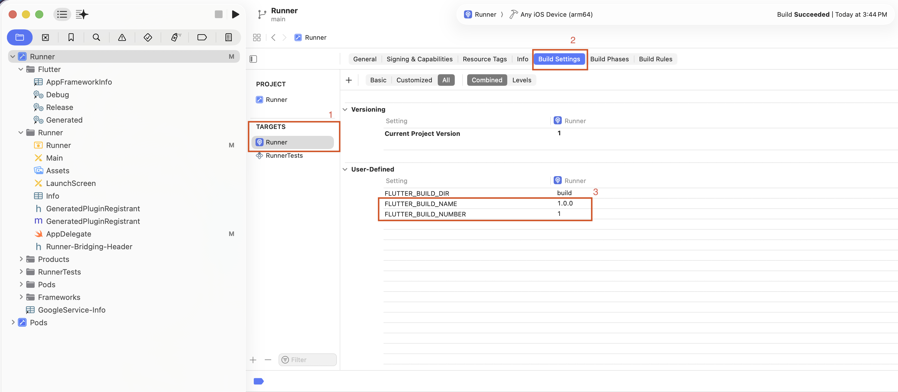

# Change the App Version

Update the version number before every new Play Store / App Store upload. 

## Version Format

Open `pubspec.yaml` (project root) and find the `version` line:

```yaml
version: 1.0.0+1
```

The value has two parts separated by `+`:

| Part | Maps to (Android) | Maps to (iOS) |
|------|-------------------|---------------|
| `1.0.0` (before `+`) | `versionName` | `CFBundleShortVersionString` |
| `1` (after `+`) | `versionCode` | `CFBundleVersion` (build number) |

## Rules

- **Version name** (`1.0.0`) — the user-visible release number. Bump it for any release that introduces new features, fixes, or breaking changes. Follow semantic versioning (`MAJOR.MINOR.PATCH`).
- **Build number** (`+1`) — must be a **strictly increasing integer**. The Play Store and App Store **reject** uploads with a build number equal to or lower than a previously uploaded one — even for the same version name.

## Steps to Change

1. Open `pubspec.yaml`.
2. Update the `version` line to the new value, for example:
   ```yaml
   version: 1.1.0+2
   ```
3. Save the file.
4. Run:
   ```bash
   flutter clean && flutter pub get
   ```
5. Build your release artifacts:
   - Android — `flutter build appbundle --release`
   - iOS — see the iOS-specific steps below before building

The new version will now show on the Play Store / App Store listing after upload.

---

## iOS — Additional Xcode Steps

iOS requires manually updating the version values in two places inside Xcode after changing `pubspec.yaml`.

### Step 1 — Update the Generated file

1. Open the project in Xcode.
2. In the left sidebar, navigate to **Runner → Flutter → Generated**.
3. Open the `Generated` file.
4. Find and update the following two lines to match your new version:

```
FLUTTER_BUILD_NAME=1.1.0
FLUTTER_BUILD_NUMBER=2
```



### Step 2 — Update Build Settings

1. In the left sidebar, select **Runner → Runner** (under TARGETS).
2. Click the **Build Settings** tab at the top.
3. Make sure **All** and **Combined** filters are selected.
4. Scroll down to the **User-Defined** section.
5. Update `FLUTTER_BUILD_NAME` and `FLUTTER_BUILD_NUMBER` to match your new version.



After both steps are done, build the iOS release:

```bash
flutter build ipa --release
```

:::warning
Always **increment the build number** for every store upload, even if the version name stays the same. The stores reject duplicate build numbers, and rebuilding without bumping will block your submission.
:::
