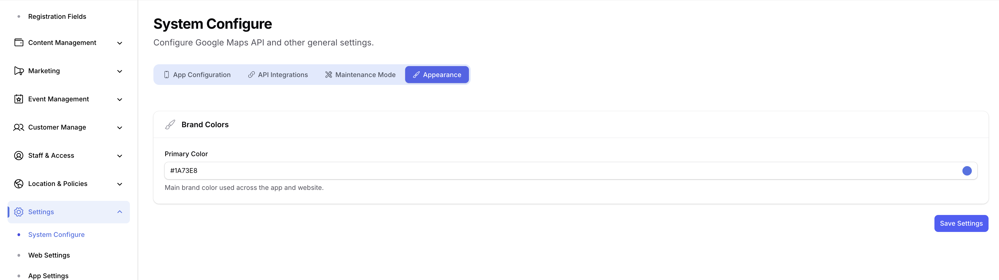

# Change App Theme Color

Update the app's primary (theme) color from the admin panel — no code changes required.

## Steps

1. Open your **Admin Panel**.
2. Navigate to **Settings → System Configure → Appearance** tab.
3. Set the new color in the **Primary Color** field.
4. Click **Save**.

:::warning
Enter the color as a **hex code only** (e.g. `#FF5722`). Other formats (RGB, named colors) are not supported and will be rejected.
:::

The app fetches the updated theme color on next launch and applies it across all primary UI elements (buttons, highlights, etc.).
