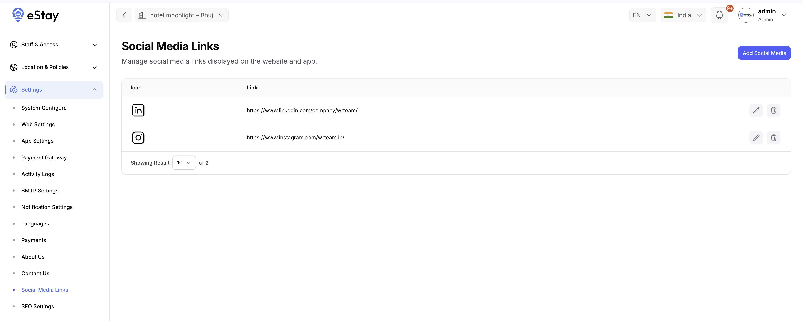

# Contact Us Page

Control the social media icons and links shown on the app's **Contact Us** screen.

## Add Social Media Links

1. Log in to the your **Admin Panel**.
2. Navigate to **Settings → Social Media Links**.
3. For each social platform you want to show:
   - **Upload an icon** (PNG / SVG recommended).
   - **Enter the link** (full URL, including `https://`).
4. Click **Save**.

The app fetches this list at runtime and renders the icons on the Contact Us page. Each icon opens its corresponding link in the device browser when tapped.

