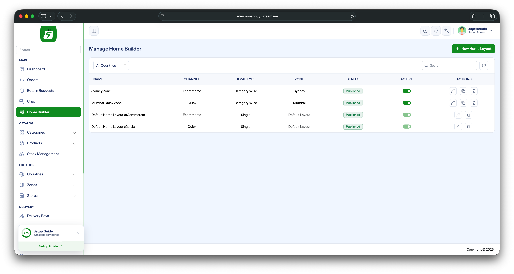
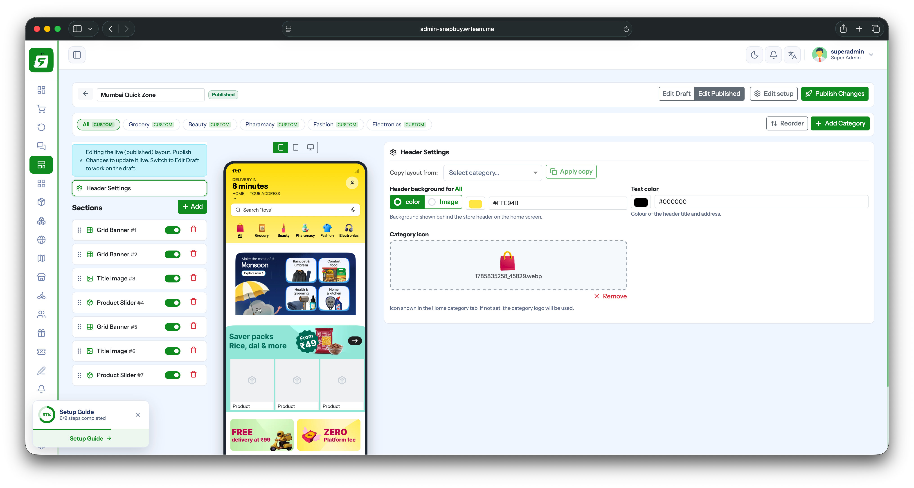
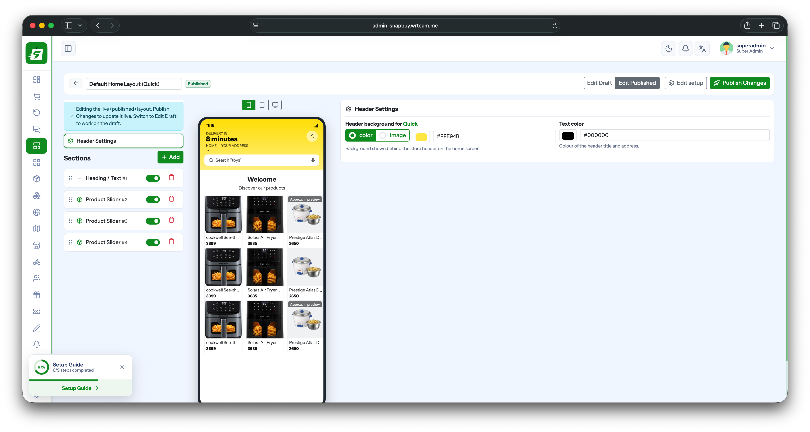
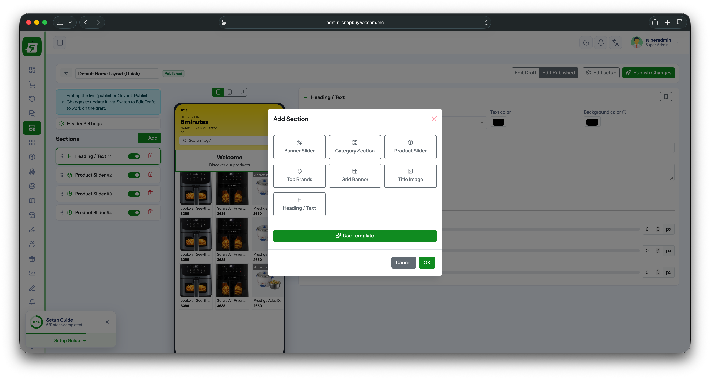

# Configure Home Screen

The app's Home screen is built and controlled from the Admin Panel using **Home Builder**, not hardcoded in the app. Layouts are created per **Zone**, so different zones can show a different Home screen.

**Admin panel path:** Sidebar → **Home Builder**

## 1. Manage Home Builder

The Home Builder list shows every layout created so far.

| Column | Meaning |
|---|---|
| Name | Layout name (e.g. zone name or `Default Home Layout`) |
| Channel | `Ecommerce` or `Quick` (quick-commerce) |
| Home Type | `Category Wise` or `Single` |
| Zone | The zone this layout applies to (or `Default Layout`) |
| Status | `Published` / `Draft` |
| Active | Toggle to enable/disable the layout |

Two `Default Home Layout` entries always exist (one for **Ecommerce**, one for **Quick**) — these are used when a zone has no dedicated layout of its own. Click **+ New Home Layout** to create a zone-specific layout, or use the row actions (edit / duplicate / delete) to manage existing ones.

## 2. Home Type — Category Wise vs Single

When creating/editing a layout, pick a **Home Type**:

- **Category Wise** — the Home screen shows a row of category tabs (e.g. All, Grocery, Beauty, Pharmacy, Fashion, Electronics). Each category tab has its **own** Header Settings and its **own** section list, so the Home screen content can differ per category.
- **Single** — one layout only, no category tabs. Used for simpler storefronts (e.g. the `Quick` default layout).

## 3. Header Settings

Controls the header shown at the top of the Home screen (behind the delivery-time / address / search bar).

- **Header background** — solid **Color** or **Image**.
- **Text color** — color of the header title and address text.
- **Category icon** *(Category Wise only)* — icon shown on the Home category tab. If not set, the category's own logo is used.
- **Copy layout from** *(Category Wise only)* — copy an existing category's header settings into the one you're editing, instead of setting it up from scratch.

## 4. Sections

Below Header Settings, the **Sections** list controls what appears on the Home screen body, top to bottom.

- Drag the handle to **reorder** sections, or use the **Reorder** button.
- Toggle a section on/off without deleting it.
- Delete (trash icon) to remove a section.
- Click **+ Add** to add a new section — choose a type from the **Add Section** dialog:

| Section Type | Shows |
|---|---|
| Banner Slider | Horizontal promotional banner carousel |
| Category Section | Grid/list of categories |
| Product Slider | Horizontal scrollable product list |
| Top Brands | Brand logos row |
| Grid Banner | Grid of promotional banner tiles |
| Title Image | Single banner image with a title |
| Heading / Text | Plain heading/subheading text block |

You can also click **Use Template** to add a pre-built set of sections instead of adding them one by one.

For **Category Wise** layouts, this section list is repeated per category tab (e.g. All, Grocery, Beauty, …) — use **Add Category** to add a new category tab to the layout.

## 5. Draft vs Published

Each layout has a **Draft** and a **Published** version:

- **Edit Draft** — work on changes without affecting the live app.
- **Edit Published** — edit the live layout directly.
- **Publish Changes** — pushes the current draft live.
- **Edit setup** — change the layout's name/channel/zone/home type.

The app always renders the **Published** version.
