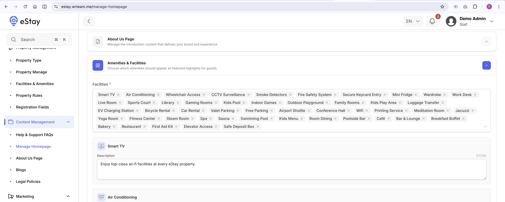

# Configure Home Screen

The app's Home screen is built from several sections, shown top to bottom. Most sections pull their content live from the admin panel — edit them there and the change reflects in the app on next refresh, no rebuild needed. A few sections are session-based or hardcoded and cannot be changed from the admin panel.

| # | Section | Admin-configurable? |
|---|---|---|
| 1 | Header (greeting, avatar, notifications) | No — user session data |
| 2 | Search Card (destination, dates, guests) | No — local to the app |
| 3 | Banner Carousel | Yes — **Banners** |
| 4 | Amenities Section | Yes — **Facilities & Amenities** |
| 5 | Explore Hotels / Explore Rooms | Yes — **Property Management** |
| 6 | How It Works | No — hardcoded steps (text only, via translations) |
| 7 | Events & Facilities | Yes — **Event Management** |

---

## 3. Banner Carousel

Promotional banner images shown as a horizontal carousel near the top of the Home screen.

**Admin panel path:** Marketing > Banner & Advertisement

Add or disable banners here — see the full [Admin Panel](/docs/admin/overview) for field details.

---

## 4. Amenities Section

Shows the top amenities (up to 4, by display order) configured for your platform.

**Admin panel path:** Sidebar → **Content Management → Manage Homepage**

---

## 5. Explore Hotels / Explore Rooms

Shows the first page of your properties (or rooms, in single-property mode). There is no separate "featured" flag — this section always reflects your main property/room list.

**Admin panel path:** Sidebar → **Property Management**

To change what appears here, edit the properties/rooms themselves — see the [Admin Panel](/docs/admin/overview).

---

## 6. How It Works

A fixed, four-step explainer of your booking process. The step text is translatable but the steps themselves are hardcoded in the app — there is no admin panel screen for this section.

:::info
To change the wording, edit the corresponding keys in your language file 
:::

---

## 7. Events & Facilities

Shows the events your properties can host (weddings, conferences, etc.).

**Admin panel path:** Sidebar → **Event Management → All Events**

See the full [Admin Panel](/docs/admin/overview) for adding and managing events.
