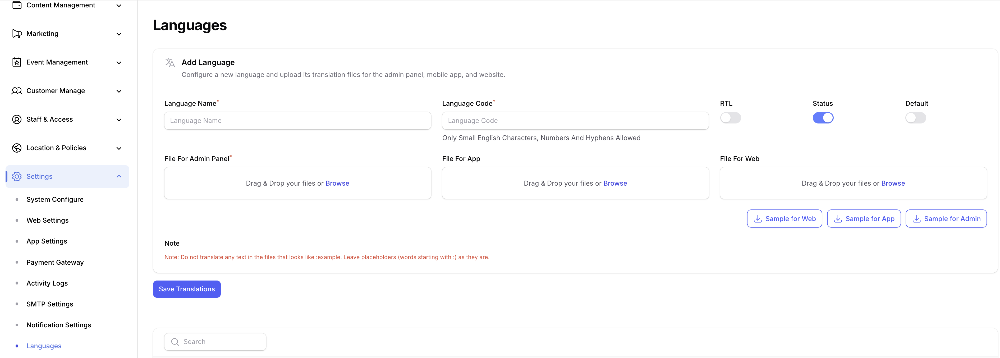
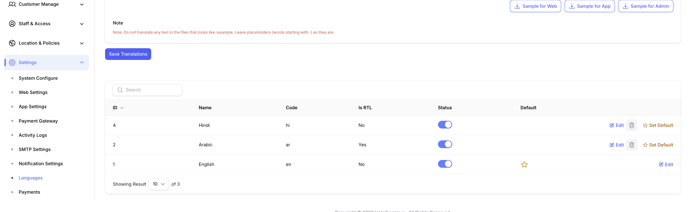

# Manage Languages

Add new languages, switch the default language, and configure the in-app fallback used when the language API can't be reached.

## 1. Add a New Language

1. Log in to the your **Admin Panel**.
2. Navigate to **Settings → Languages**.
3. **Download the sample translation file** for each platform (App, Web, Admin Panel) from the form.
4. Open the downloaded file and **translate only the values** in the `key: value` pairs. **Do not change the keys** — the app looks them up by key, so any change will break the lookup.
5. Once translated, return to the **Add Language** form, fill in the language name and code, **upload the translated file(s)**, then save.

:::warning
Edit only the right-hand side of each `key: value` pair. Changing, removing, or adding keys will cause missing strings in the app.
:::

## 2. Change the Default Language

1. Stay on the **Settings → Languages** tab.
2. Scroll to the language list below the form.
3. Find the language you want as default and click the **Set Default** button next to it.

The app will pick this language on first launch for users.

## 3. Fallback Default in App Code

As a safety net, a default language code is hardcoded in the app's config file. This value is **only used when the settings API call fails** (e.g., no internet on first launch).

1. Open `lib/core/configs/app_config.dart`.
2. Update the default language constant to the language code you want as fallback.

:::info
The admin-panel default (Step 2) is the **primary** source of truth. The `app_config.dart` value (Step 3) is only a fallback for offline / API-failure scenarios.
:::
