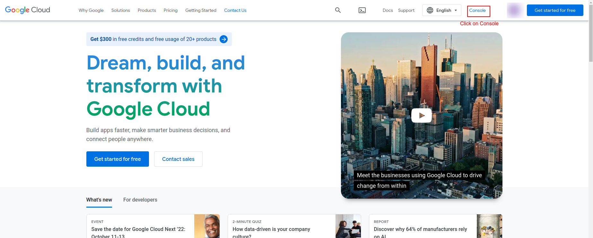
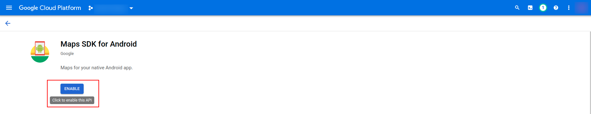

# Add Map API Key

The app uses Google Maps for showing nearby locations of property. You need a Google Cloud API key with the **Maps SDK for Android** and **Maps SDK for iOS** enabled.

## Step 1 — Open Google Cloud Console

1. Visit [https://cloud.google.com/](https://cloud.google.com/) and sign in with your Google account.
2. Click **Console** (top-right) to open the Google Cloud Console.
3. Create a new project, or select an existing one from the project picker.




## Step 2 — Enable Required APIs

In the left sidebar, go to **APIs & Services → Library**, then search for and enable the following APIs:

- **Maps SDK for Android**
- **Maps SDK for iOS**

For each one, click the API → **Enable**.




## Step 3 — Create an API Key

Google recommends creating **two separate keys** — one for Android, one for iOS — instead of one shared key. Each platform uses a different restriction type (package name + SHA-1 for Android, bundle ID for iOS), and a single key cannot carry both restrictions at once. Separate keys also let you revoke or rotate one platform's key without breaking the other.

1. Go to **APIs & Services → Credentials**.
2. Click **+ Create Credentials → API key**.
3. Edit newly created key, rename it something clear like `Android Maps Key`, add the **Maps SDK for Android** API from Step 2, and tap **Save**.
4. Repeat steps 2–3 to create a second key named `iOS Maps Key`, this time adding the **Maps SDK for iOS** API.
5. Copy both generated keys — you will paste them into the app code in Step 4.


## Step 3.1 — Restrict Each Key for Production

Before releasing to production, restrict each key so it only works from your app. An unrestricted key can be copied from your app package and used by anyone.

**Android key restrictions:**
1. Open the Android key in **Credentials**.
2. Under **Application restrictions**, select **Android apps**.
3. Click **Add an item** and enter your app's **package name** (e.g. `com.yourcompany.estay`) and its **SHA-1 certificate fingerprint** (get it via `keytool -list -v -keystore your.keystore` or from Play Console → App signing).
4. Under **API restrictions**, select **Restrict key** and check only **Maps SDK for Android**.
5. Save.

**iOS key restrictions:**
1. Open the iOS key in **Credentials**.
2. Under **Application restrictions**, select **iOS apps**.
3. Click **Add an item** and enter your app's **bundle identifier** (e.g. `com.yourcompany.estay`, found in Xcode → Runner target → General).
4. Under **API restrictions**, select **Restrict key** and check only **Maps SDK for iOS**.
5. Save.

:::tip
Add both your debug and release SHA-1 fingerprints for the Android key, or map testing will break in debug builds while working in release (or vice versa).
:::

## Step 4 — Paste the Key into the App

### Android — `AndroidManifest.xml`

Open `android/app/src/main/AndroidManifest.xml` and add the following `<meta-data>` tag inside the `<application>` tag:

```xml
<meta-data
    android:name="com.google.android.geo.API_KEY"
    android:value="YOUR_MAP_API_KEY_HERE"/>
```

Replace `YOUR_MAP_API_KEY_HERE` with the **Android key** you copied in Step 3.

### iOS — `AppDelegate.swift`

Open `ios/Runner/AppDelegate.swift` and search for the following line:

```swift

    GMSServices.provideAPIKey("YOUR_MAP_API_KEY_HERE")
  
```

Replace `YOUR_MAP_API_KEY_HERE` with the **iOS key** you copied in Step 3.

## Step 5 — Rebuild

```bash
flutter clean && flutter run
```

Maps should now load correctly on both platforms.

:::warning
Never commit your raw API keys to a public repository. Apply key restrictions (Step 3.1) before release, and consider storing keys in a non-tracked file for production builds.
:::
