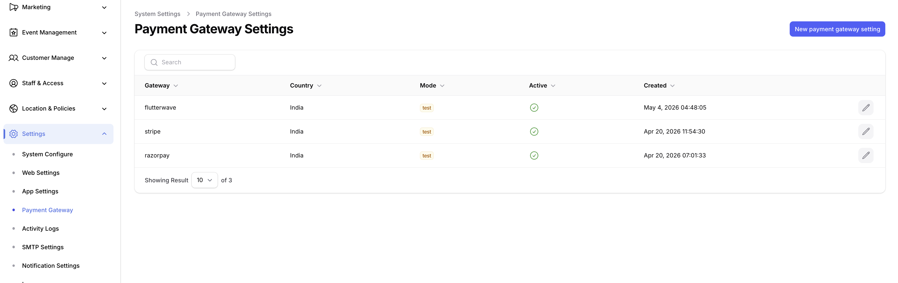
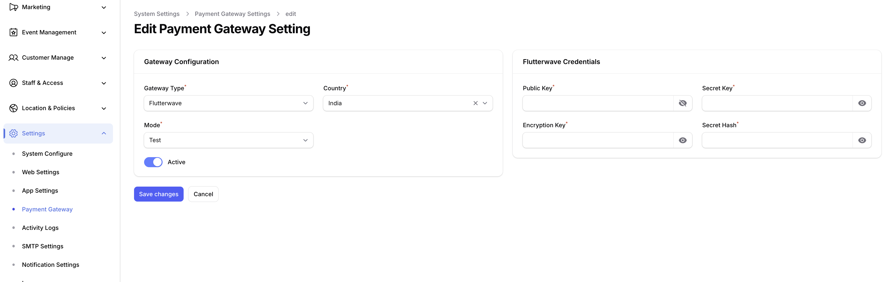

# Manage Payment Gateway and Credentials

Configure which payment gateways are available in the app and enter their API credentials.

## Supported Gateways

The system has built-in integration for **three** payment gateways:

- **Flutterwave**
- **Stripe**
- **Razorpay**

Only these three can be added — pick them which most closely match your business needs.

## 1. Add and Configure a Gateway

1. Open your **Admin Panel**.
2. Navigate to **Settings → Payment Gateway**.
3. Click **Payment Gateway Setting** and select one from the supported list.
4. Enter the required credentials (API keys / secrets / publishable key, depending on the gateway).
5. Click **Save**.

## 2. Activate / Deactivate an Existing Gateway

To turn an already-added gateway on or off without deleting its credentials:

1. Return to **Settings → Payment Gateway**.
2. Find the gateway in the list and click **Edit**.
3. Toggle the **Status** field (Active / Inactive).
4. Click **Save**.

:::tip
You can keep credentials saved for multiple gateways and only mark one as **Active** at a time — useful when switching providers without re-entering keys.
:::
