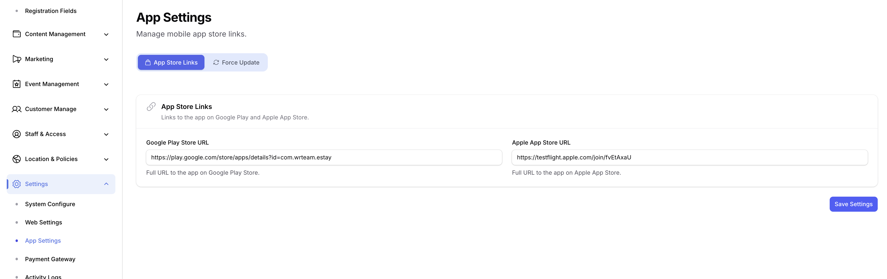

# App Store URLs & Force Update

Configure the Play Store / App Store URLs used by **Share** and **Rate App** features, and set the minimum supported app version for **Force Update**.

## 1. App Store Links

1. Open your **Admin Panel**.
2. Navigate to **Settings → App Settings → App Store Links** tab.
3. Set the following:
   - **Play Store URL** — full link to your Android app on Google Play.
   - **App Store URL** — full link to your iOS app on Apple App Store.
4. Click **Save**.

:::warning
Without these URLs set, the in-app **Share** and **Rate App** features will not work.
:::

## 2. Force Update

Use the Force Update tab to prompt users on outdated app versions to upgrade before continuing.

1. Stay in **Settings → App Settings**.
2. Switch to the **Force Update** tab.
3. Set the following:
   - **Android Version Code** — the `versionCode` of the latest build currently live on the Play Store.
   - **iOS Version Name** — the `version` (e.g. `1.2.0`) of the latest build uploaded to the App Store.
4. Click **Save**.

Any user on a lower version will see the force-update prompt on next launch and be redirected to the store to install the latest build.

:::tip
Update these values every time you publish a new release so that older users are nudged to upgrade.
:::
