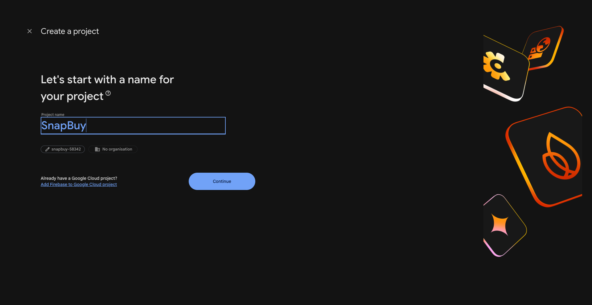
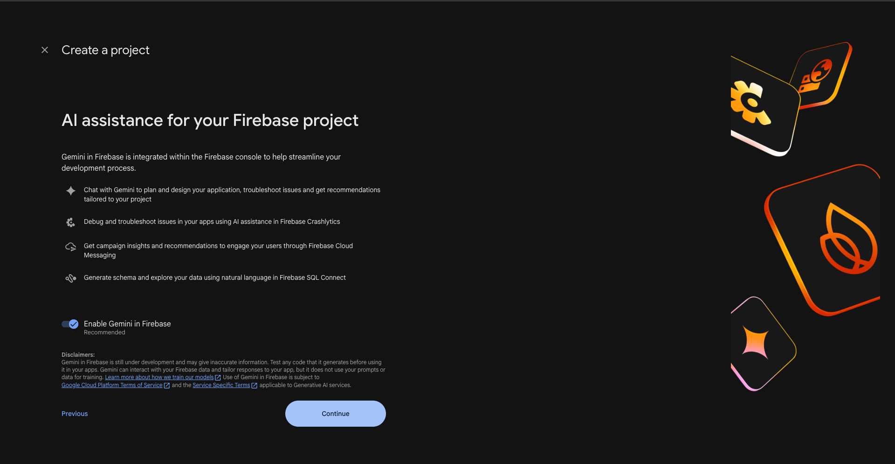
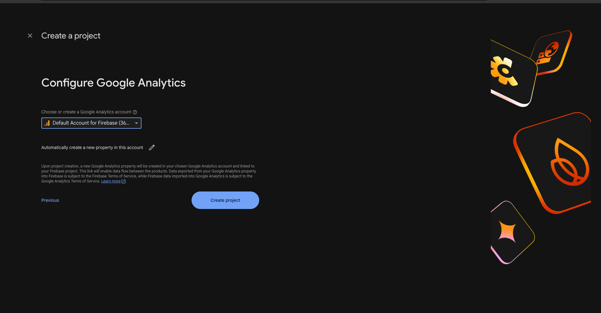
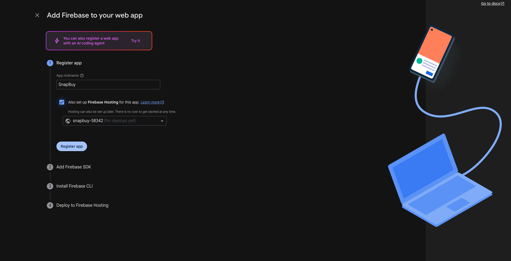
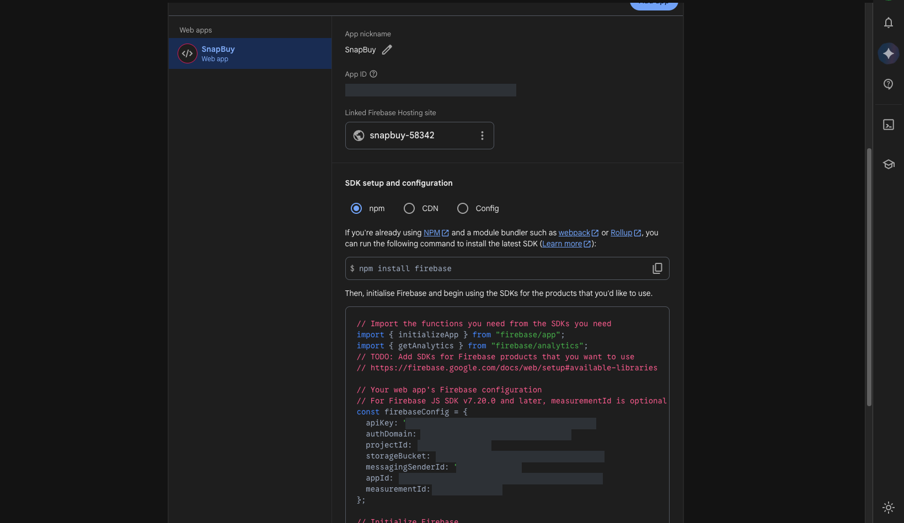
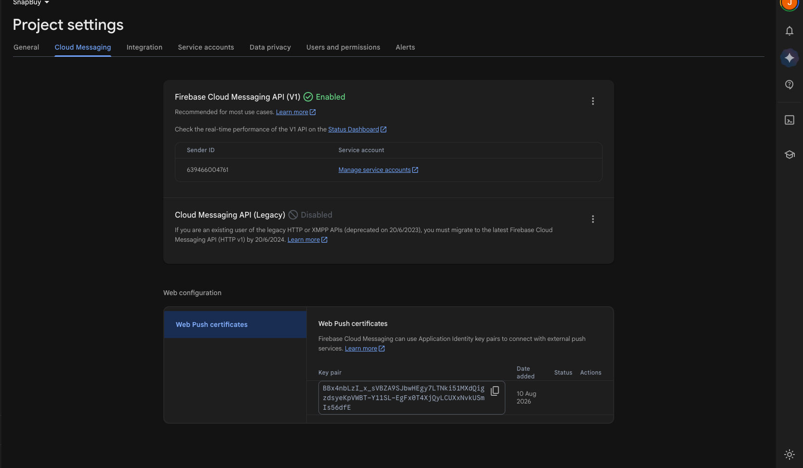

# Firebase Setup

The SnapBuy Web Portal uses **Firebase Cloud Messaging (FCM)** to deliver push notifications — order updates, offers, and delivery status — to customers' browsers.

This guide covers creating the Firebase project, wiring the credentials into the app, and verifying that notifications actually arrive.

## Before you start

- Push notifications require **HTTPS**. They will not work over plain HTTP, and on `localhost` support varies by browser. Plan to test on a real HTTPS domain.
- FCM web push is unsupported in some browsers (notably iOS Safari below 16.4). The app detects this and shows an "install the app instead" note rather than failing.

## 1. Create a Firebase project

1. Open the [Firebase Console](https://console.firebase.google.com/).
2. Click **Add project** and enter a project name, then click **Continue**.



3. The wizard offers **Gemini in Firebase** (AI assistance). This is optional and not required for push notifications — leave it on or switch it off, then click **Continue**.



4. Google Analytics is also optional. Pick an account (or skip it), then click **Create project**.



## 2. Register a Web app

1. In the project dashboard, click the **Web** icon (`</>`).
2. Give it a nickname (e.g. "Storefront"). **Firebase Hosting is not required** — the Web Portal runs on your own VPS. The wizard may leave the "Also set up Firebase Hosting" box checked by default; uncheck it unless you specifically plan to deploy to Firebase Hosting.
3. Click **Register app**.



4. Firebase then shows a `firebaseConfig` object. **Keep this open** — you need all seven values twice, in two different files.

```js
// what Firebase shows you
const firebaseConfig = {
  apiKey: "…",
  authDomain: "…",
  projectId: "…",
  storageBucket: "…",
  messagingSenderId: "…",
  appId: "…",
  measurementId: "…",
};
```

If you close the wizard, the same values are always available under **Project Settings → General → Your apps**. Select your app, then choose the **Config** radio button under **SDK setup and configuration**:



:::note

The values are blanked out in the screenshots above. Use the ones shown in **your own** Firebase console.

:::

## 3. Enable Cloud Messaging and get the VAPID key

1. Go to **Project Settings** (gear icon) → **Cloud Messaging**.
2. Confirm **Firebase Cloud Messaging API (V1)** is **Enabled**. If it shows as disabled, use the three-dot menu to enable it in Google Cloud Console.
3. Scroll to **Web configuration → Web Push certificates**.
4. Click **Generate key pair**. The resulting string is your **VAPID key** — copy it.



Without the VAPID key the browser cannot mint an FCM token, and no device is ever registered.

:::note

**Cloud Messaging API (Legacy)** shows as *Disabled* on this screen — that is correct. The legacy HTTP API was deprecated in 2023; the Web Portal uses the **V1** API, which must show **Enabled**.

:::

## 4. Add credentials to `.env`

The app reads its Firebase config from environment variables in `src/utils/firebase.js`:

```env
NEXT_PUBLIC_FIREBASE_API_KEY=your-firebase-api-key
NEXT_PUBLIC_FIREBASE_AUTH_DOMAIN=your-project-id.firebaseapp.com
NEXT_PUBLIC_FIREBASE_PROJECT_ID=your-project-id
NEXT_PUBLIC_FIREBASE_STORAGE_BUCKET=your-project-id.firebasestorage.app
NEXT_PUBLIC_FIREBASE_MESSAGING_SENDER_ID=your-sender-id
NEXT_PUBLIC_FIREBASE_APP_ID=your-app-id
NEXT_PUBLIC_FIREBASE_MEASUREMENT_ID=your-measurement-id
NEXT_PUBLIC_FIREBASE_VAPID_KEY=your-vapid-key
```

:::warning

`.env` values are inlined at **build time**. After changing them you must rebuild (`npm run build`) and restart — a reload is not enough.

:::

## 5. Update the service worker

Background notifications — the ones that arrive when the tab is not focused — are handled by `public/firebase-messaging-sw.js`.

A service worker runs outside the bundle and **cannot read `NEXT_PUBLIC_` variables**, so the same credentials have to be written into the file literally.

Open `public/firebase-messaging-sw.js` and replace the config in `firebase.initializeApp({ … })` with your own:

```js
firebase.initializeApp({
  apiKey: "your-firebase-api-key",
  authDomain: "your-project-id.firebaseapp.com",
  projectId: "your-project-id",
  storageBucket: "your-project-id.firebasestorage.app",
  messagingSenderId: "your-sender-id",
  appId: "your-app-id",
  measurementId: "your-measurement-id",
});
```

Three things to get right:

- Values **must match `.env` exactly**. If they differ, foreground and background notifications register against different Firebase projects and one of them silently stops working.
- Use plain values — no `NEXT_PUBLIC_` prefix, no `process.env`.
- Keep the `firebase.initializeApp(...)` **call**. Replacing it with a bare config object throws during script evaluation, which fails the entire service worker registration.

:::danger Replace the bundled development key

The repository ships with a working development Firebase key committed to this file. Replace it with your own before going live.

Web Firebase keys are public by design (any visitor can read them), so the protection is a restriction, not secrecy: in Google Cloud Console → **APIs & Services → Credentials**, restrict the key by **HTTP referrer** to your production domain.

:::

## Related guides

- [Installation Steps](/docs/web/installation-steps) — full `.env` reference
- [Deployment Guide (VPS)](/docs/web/deployment) — HTTPS and proxy setup
- [File Structure](/docs/web/file-structure) — where the Firebase code lives
